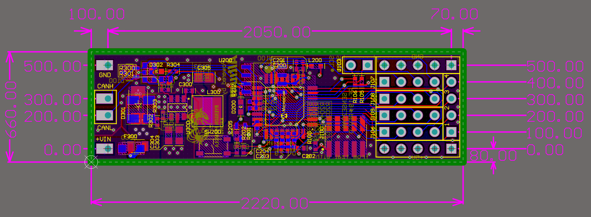
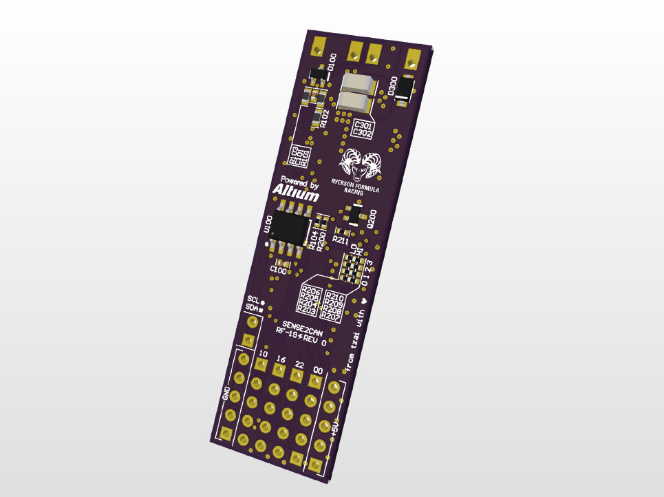
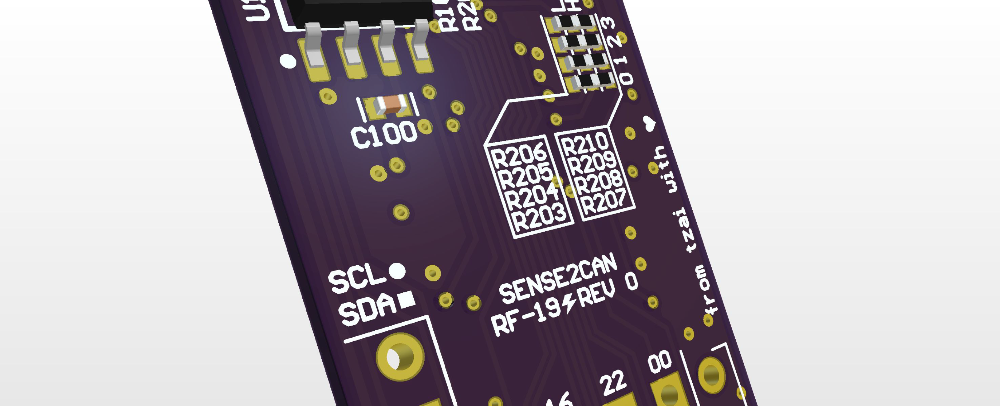

# RF-19 SENSE2CAN Module
The SENSE2CAN module is a SAMC21-based CAN bus DAQ module for Ryerson Formula Racing's RF-19 vehicle.

## Overview

The SENSE2CAN has the following features:
* ATSAMC21E18A 32-bit ARM Cortex M0+ MCU
* CAN bus connectivity with ESD protection and optional on-board termination
* 4 dedicated analog inputs
* Dedicated I2C breakout
* Breakout area for all I/O pins
* +5V and GND breakout
* 4 pinstraps meant for configuring CAN ID through the BOM to avoid firmware modification
* Power status LED
* Generic GPIO-controlled LED
* 8-26V input with transient suppression, reverse polarity protection and resettable fuse

## Gallery

